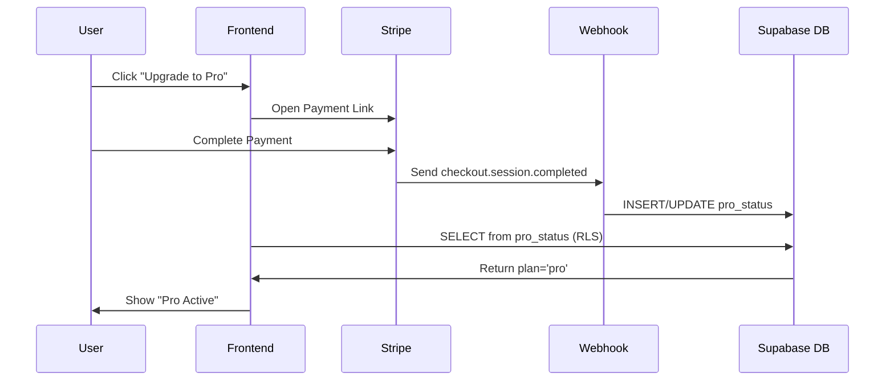

# ✅ Stripe Webhook Integration - Complete!

## What Changed

The subscription system has been completely redesigned to eliminate CORS issues and simplify the architecture:

### Before (Problems):
- ❌ Client called `check-subscription` edge function (CORS issues)
- ❌ Polling every minute for subscription status
- ❌ Complex error handling for preflight requests
- ❌ Required `create-checkout` function calls

### After (Solution):
- ✅ Stripe webhooks update subscription server-to-server (no CORS)
- ✅ Frontend reads directly from `pro_status` table via RLS
- ✅ Payment Links instead of checkout sessions
- ✅ No function calls except customer portal

## Files Created

1. **`supabase/functions/stripe-webhook/index.ts`** - Webhook handler
2. **`supabase_sql/pro_status.sql`** - Database schema + RLS policies
3. **`STRIPE_WEBHOOK_SETUP.md`** - Detailed setup instructions

## Files Modified

1. **`src/contexts/SubscriptionContext.tsx`** - Removed function calls, reads from table
2. **`src/pages/Upgrade.tsx`** - Uses Payment Links
3. **`src/pages/Settings.tsx`** - Uses Payment Links
4. **`src/pages/Editor.tsx`** - Updated plan detection
5. **`src/pages/Landing.tsx`** - Updated pricing logic
6. **`src/pages/Profile.tsx`** - Reads from pro_status table
7. **`src/pages/upgrade/Success.tsx`** - Uses refreshSubscription

## Setup Instructions

### 1. Run SQL Migration

Copy and paste the contents of `supabase_sql/pro_status.sql` into your Supabase SQL Editor:

```sql
-- Creates pro_status table with RLS policies
```

### 2. Configure Environment Variables

In Supabase → Project Settings → Edge Functions → Environment Variables:

```bash
STRIPE_WEBHOOK_SECRET=whsec_... # Get this after configuring webhook in Stripe
```

### 3. Configure Stripe Webhook

1. Go to Stripe Dashboard → Developers → Webhooks
2. Click "Add endpoint"
3. URL: `https://hxjlplwqpkstkjyekrce.supabase.co/functions/v1/stripe-webhook`
4. Select events:
   - `checkout.session.completed`
   - `invoice.paid`
   - `customer.subscription.updated`
   - `customer.subscription.created`
   - `customer.subscription.deleted`
5. Copy the signing secret and add to Supabase env vars

### 4. Test the Integration

1. **Make a test payment:**
   - Click "Upgrade to Pro" on `/upgrade`
   - Complete payment via Stripe Payment Link
   - Stripe sends webhook to your function
   - Function updates `pro_status` table

2. **Verify in database:**
   ```sql
   SELECT * FROM public.pro_status;
   ```

3. **Check frontend:**
   - Refresh `/upgrade` or `/settings`
   - Should show "Pro Active" badge

## How It Works



## Payment Links

Already configured in the code:

- **Pro ($19/mo)**: https://buy.stripe.com/bJe7sMgxegr48nvdlj9sk00
- **Business ($49/mo)**: https://buy.stripe.com/fZu3cw94M5Mq6fn5SR9sk01

## Removed Functions

These edge functions are no longer called:
- ✅ `check-subscription` - Replaced with direct table reads
- ✅ `create-checkout` - Replaced with Payment Links

**Kept:**
- ✅ `customer-portal` - Still used for managing subscriptions

## Troubleshooting

### Webhook not firing
- Check Stripe Dashboard → Webhooks → Logs
- Verify webhook URL is correct
- Check `STRIPE_WEBHOOK_SECRET` is set

### Pro status not updating
- Check Supabase logs for webhook function
- Verify `SUPABASE_SERVICE_ROLE_KEY` is correct
- Test webhook manually with Stripe CLI:
  ```bash
  stripe trigger checkout.session.completed
  ```

### User can't see pro status
- Verify user is logged in with correct email
- Check RLS policies on `pro_status` table
- Query directly:
  ```sql
  SELECT * FROM pro_status WHERE email = 'user@example.com';
  ```

## Success Criteria ✅

- [x] No CORS errors in console
- [x] No calls to `check-subscription` function
- [x] Payment Links work correctly
- [x] Webhook updates database
- [x] Frontend shows correct subscription status
- [x] Customer portal still works

## Next Steps

1. Run the SQL migration
2. Configure webhook in Stripe
3. Test with a real payment
4. Monitor webhook logs in Stripe Dashboard
5. Check Supabase logs if issues arise

For detailed setup instructions, see `STRIPE_WEBHOOK_SETUP.md`.
